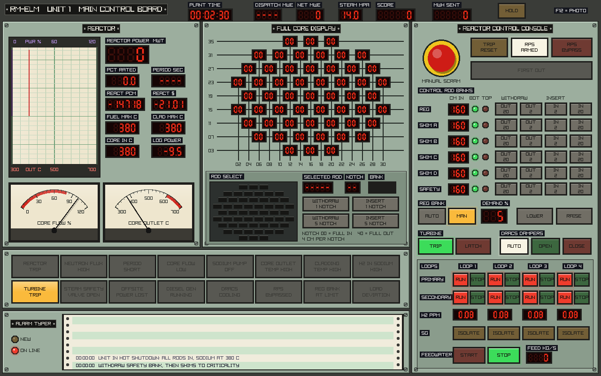

# RM-ELM

A realistic simulator of a fictional **Reduced-Moderation Epithermal
Liquid-Metal reactor**: a 2300 MWt, four-loop, sodium-cooled core moderated by
canned graphite and zirconium-hydride pins, fuelled with (U,Th) carbide
(20% U-235 / 30% U-238 / 50% Th-232 by heavy-metal weight).

Written in C17 with hand-written x86-64 assembly for the hot loops (with
portable C fallbacks that give identical results). The reactor physics comes
from lattice calculations on ENDF/B-VIII.1 nuclear data, not hand-tuned numbers.

## Build

Needs a C compiler (GCC or Clang), CMake 3.16+ and git.

```sh
cmake -S . -B build
cmake --build build
cd build && ctest --output-on-failure   # optional: run the test suite
```

On x86-64 the assembly kernels are assembled automatically by the compiler;
the program picks AVX or SSE2 at run time. On ARM or MSVC the C kernels are
used. Force C with `-DRMELM_USE_ASM=OFF`.

## Play: graphical control room

```sh
./build/rmelm_gui
```


A point-and-click main control board drawn in 1978 style. At launch you pick
**start at rated power** or **start from hot shutdown**, and whether random
equipment failures are on. The sim runs in real time; HOLD pauses it and F12
saves a screenshot.

### The job

The **load dispatcher** orders net output in MWe (header, DISPATCH MWE) and
changes the order every 10 to 20 minutes, with a ramp rate. You follow it with
the power demand (RAISE/LOWER) while automatic rod control holds the reactor
there. You score one point per MWh sent out within 3% of the order (half
within 10%), +200 for synchronising, and +300 for isolating a leaking steam
generator before it fails. Penalties: -500 per reactor trip, -1000 for losing
an SG to a sodium-water reaction, -100 per turbine trip, and points bleed away
while the RPS is bypassed or the cladding is over 650 C.

Equipment fails at random (about one event every 20 minutes at power):
- pump trips;
- steam generator tube leaks;
- turbine trips;
- diesel generators out of service;
- grid faults;
- load dispatcher frequency calls.

### Boards

- **Reactor**: strip-chart recorder (power in violet, core outlet in red),
  LED readouts including period and log power for the source range, core
  flow and outlet meters.
- **Full core display**: a BWR-style board with a 2-digit LED notch readout
  for each of the 55 rods, laid out in the core's shape (00 = fully in,
  40 = fully out, 4 cm per notch, rods named by grid coordinates such as
  16-19). The rod select matrix below it has one pushbutton per rod: select
  one, then WITHDRAW/INSERT it by 1 or 5 notches.
- **Reactor control console**:
  - Mushroom-head manual scram, trip reset, RPS armed/bypass, first-out window.
  - Rod bank buttons (OUT/IN by 20 or 2 cm, with bottom/top lamps).
  - AUTO/MAN regulating bank control with the power demand.
  - Turbine TRIP/LATCH and DRACS dampers.
  - **Loop control**: RUN/STOP for every primary and secondary pump, the
    hydrogen-in-sodium meter and ISOLATE button for each steam generator, and
    the feedwater pumps.
- **Annunciators** (red ones flash) and the **alarm typer**, where the
  dispatcher, the shift supervisor and the plant report events.

Lamps follow the US convention of the period: red = running/closed,
green = stopped/open.

### Starting up from hot shutdown



All 55 rods are in, the reactor is deeply subcritical (about -14,700 pcm),
the sodium is isothermal at 380 C with the pumps running, and feedwater is
off.

1. Withdraw the SAFETY bank fully (OUT 20 until the TOP lamp).
2. Withdraw the shim banks in steps while you watch the period and log power.
   The core goes critical with the shims at about 72 cm. A period shorter
   than 10 s trips the reactor.
3. Set the demand to a few percent and select AUTO. Automatic rod control
   limits the startup rate to a period of about 60 s or longer.
4. At a few percent, START the feedwater. Feed holds each loop's cold leg at
   380 C at any power.
5. Above 8% power, with steam above 10 MPa, LATCH the turbine. The
   dispatcher takes over and the unit is on line.
6. Raise the demand. When the REG BANK AT LIMIT annunciator lights, pull the
   shims a little to give the regulating bank room.

### Steam generator leaks

A tube leak lets water into the secondary sodium. The sodium-water reaction
makes hydrogen, and the jet wastes neighbouring tubes, so the leak doubles
about every 90 s. The hydrogen meter (H2 PPM) is the only warning: the H2 IN
SODIUM HIGH alarm comes in at 0.3 ppm, when the leak is around 1 g/s. From
there you have about 15 minutes. Isolate that SG, stop its secondary pump
and run back to about 75%. If you don't, the leak reaches 2 kg/s, the
rupture disc bursts, the loop's sodium is dumped and the reactor trips.

### Building on Linux

The first `cmake` configure downloads raylib 5.5 automatically (or uses one
already installed). On Linux you need the X11/OpenGL development packages,
plus the Wayland ones if you run a Wayland desktop. The GUI then talks to the
compositor natively instead of going through XWayland:

- Debian/Ubuntu: `sudo apt install libgl-dev libx11-dev libxrandr-dev
  libxinerama-dev libxcursor-dev libxi-dev libwayland-dev libxkbcommon-dev
  wayland-protocols`
- Arch: `sudo pacman -S --needed base-devel cmake git libx11 libxrandr
  libxinerama libxcursor libxi mesa wayland wayland-protocols libxkbcommon`

CMake prints `RM-ELM: GUI with native Wayland and X11` when it found the
Wayland files. To skip the GUI: `-DRMELM_GUI=OFF`.

The GUI uses an OpenGL 2.1 context, which almost every driver supports. To
build for OpenGL 3.3 core instead: `-DRMELM_GL33=ON`.

## Play: terminal process computer

```sh
./build/rmelm                  # at rated power
./build/rmelm --hot            # from hot shutdown
./build/rmelm --no-failures    # no random equipment failures
```

Linux, macOS or WSL terminal. Start-up takes about 20 seconds while the
plant converges. The same plant, dispatcher, score and failures as the GUI.

The screen shows:
- the load dispatcher's order, your deviation and the score;
- the reactor: power, reactivity, period, rod banks, RPS status and first out;
- the core: flow, inlet/outlet, peak fuel and clad temperatures;
- all four loops: pumps, sodium temperatures, feedwater, steam and hydrogen;
- the steam plant and turbine-generator;
- a power trend and the message log.

| Command | What it does |
|---|---|
| `ROD <bank> <cm>` | drive a bank to a depth: 0 = out, 160 = in. Banks: `REG A B C D SAFE ALL` |
| `AUTO <%>` / `AUTO OFF` | automatic rod control: the REG bank holds reactor power at the demand |
| `SCRAM` / `RESET` | trip the reactor / reset the protection system (rods stay in) |
| `PUMP P1..P4 START\|STOP\|PONY\|SPEED <%>` | primary pumps (`PONY` toggles the 10% pony motor) |
| `PUMP S1..S4 START\|STOP\|SPEED <%>` | intermediate (secondary) sodium pumps |
| `FW START\|STOP` | feedwater pumps in or out of service |
| `FW AUTO\|MAN` | feedwater control (auto holds the cold legs at 380 C) |
| `SG <1-4> ISOLATE` | isolate a steam generator (feed and steam valves shut, blown down) |
| `TURB TRIP\|RESET` | trip the turbine / latch and synchronise (above 8% power, steam above 10 MPa) |
| `PSET <MPa>` | steam pressure setpoint (turbine valve holds it) |
| `DRACS OPEN\|CLOSE\|AUTO` | decay heat removal coolers (auto opens on a reactor trip) |
| `RPS ON\|BYPASS` | arm or bypass the reactor protection system |
| `HELP`, `QUIT` | |

Automatic reactor trips:
- power 115%, period 10 s, power/flow 1.15;
- primary flow below 70%, two primary pumps off;
- core outlet 600 C, clad 700 C;
- steam pressure 16.5 MPa;
- turbine trip above 50% power;
- loss of offsite power;
- a steam generator rupture disc bursting.

A reactor trip trips the turbine. After a trip, DRACS takes the decay heat by
natural circulation even with no power at all.
