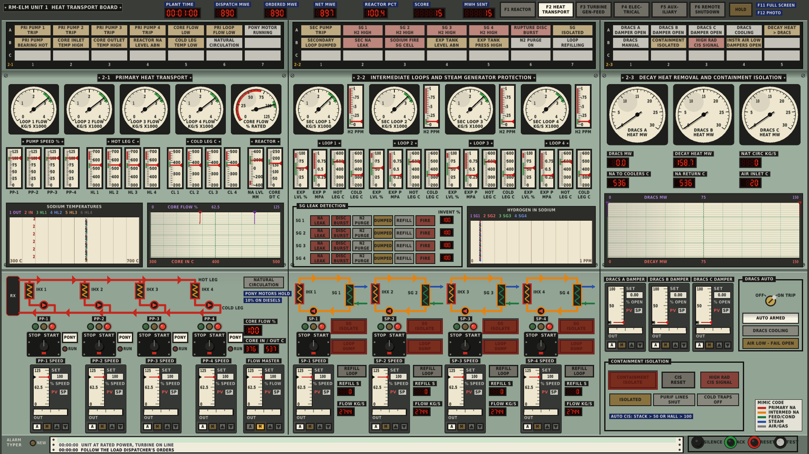
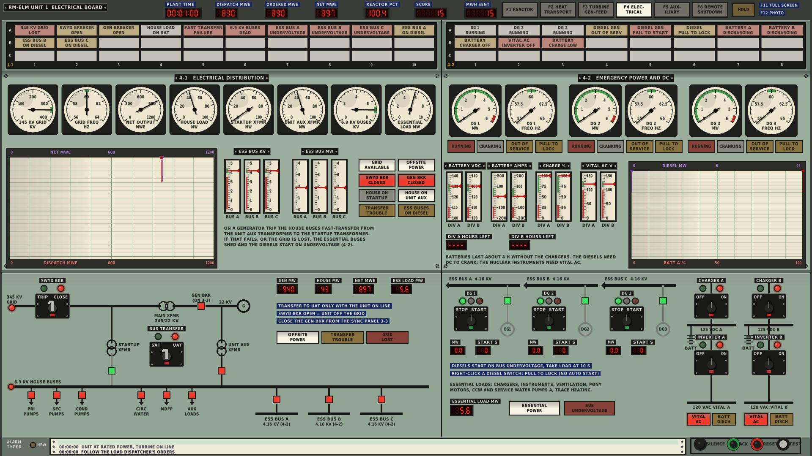

# RM-ELM

A realistic simulator of a fictional **Reduced-Moderation Epithermal
Liquid-Metal reactor**: a 2300 MWt, four-loop, sodium-cooled core moderated by
canned graphite and zirconium-hydride pins, fuelled with (U,Th) carbide
(20% U-235 / 30% U-238 / 50% Th-232 by heavy-metal weight).

Written in C17 with hand-written x86-64 assembly for the hot loops (with
portable C fallbacks that give identical results). The reactor physics comes
from lattice calculations on ENDF/B-VIII.1 nuclear data, not hand-tuned numbers.

## Build

Needs a C compiler (GCC or Clang), CMake 3.16+ and git.

```sh
cmake -S . -B build
cmake --build build
cd build && ctest --output-on-failure   # optional: run the test suite
```

On x86-64 the assembly kernels are assembled automatically by the compiler;
the program picks AVX or SSE2 at run time. On ARM or MSVC the C kernels are
used. Force C with `-DRMELM_USE_ASM=OFF`.

## Play: graphical control room

```sh
./build/rmelm_gui
```


A point-and-click control room drawn in 1978 style, after the US plants of
the period (the TMI-2 and Shoreham human-factors reviews, the FFTF and Clinch
River sodium plants; see [docs/control_room_research.md](docs/control_room_research.md)).
Each board is a row of system sections. Every section has its own
annunciator window box on the hood, a vertical panel of switchboard and
edgewise meters and chart recorders, and a sloped benchboard with the control
switches, M/A stations and pushbuttons laid out on a colour-coded mimic
(red primary sodium, orange intermediate sodium, green feed, blue steam, grey
air and gas, black electrical). Engraved nameplates, black demarcation tape
round groups of controls, and blue label tape where the operators added their
own notes. An alarm typer runs along the front of every board.

Each board is laid out on a 1920x1080 canvas but drawn at your display's own
resolution (sharp on 1440p and 4K screens), with 2x supersampling for smooth
edges; `RMELM_SUPERSAMPLE=1` turns that off on a slow machine. The lettering
is DejaVu Sans Bold, compiled in. It runs borderless full screen (F11 toggles
it; `RMELM_WINDOWED=1` starts in a window). At launch you pick **start at rated power** or **start from hot
shutdown**, and whether random equipment failures are on. The sim runs in real
time. HOLD pauses it, and F12 saves a screenshot (`screenshotNNN.png`).

There are six boards. Pick one with the buttons in the header or F1 to F6. A
board's button flashes when it has an unacknowledged alarm.

| Key | Board | Sections |
|-----|-------|----------|
| F1 | Reactor | 1-1 nuclear instrumentation and protection, 1-2 reactor control, 1-3 core monitoring |
| F2 | Heat transport | 2-1 primary, 2-2 intermediate loops and SG protection, 2-3 decay heat removal and containment isolation |
| F3 | Turbine-generator | 3-1 feedwater and main steam, 3-2 turbine and condenser, 3-3 generator |
| F4 | Electrical | 4-1 distribution, 4-2 emergency power and DC |
| F5 | Auxiliary | 5-1 sodium auxiliaries, 5-2 containment and radiation, 5-3 plant services and fire protection |
| F6 | Remote shutdown panel | RSP-1 reactor and decay heat removal, RSP-2 emergency power, steam and feed |

### Controls

- **Pistol-grip and J-handle switches.** Click the left half of a switch to
  turn it left (STOP, TRIP, OFF, SHUT), or the right half to turn it right
  (START, CLOSE, ON, OPEN). It springs back to centre. Green lamp =
  stopped/open, red = running/closed; a third lamp, where there is one, shows
  a trip (amber) or cranking (white). The small target flag under the handle
  shows the last operation, so a green lamp next to a red flag means the
  equipment tripped on its own. Right click a diesel generator switch for
  **pull-to-lock**, which blocks its automatic start.
- **M/A stations** (manual/automatic controllers). The scale shows the
  process value (red pointer) against the setpoint (black index); the SET
  window shows the setpoint and OUT the controller output. A puts it in
  automatic, M in manual. The arrows raise and lower the setpoint in AUTO or
  the output in MAN, and repeat while held. Stations without A/M are manual
  loading stations.
- **Guarded pushbuttons.** The first click lifts the red guard for a few
  seconds; the second pushes the button (SG isolate, loop dump, containment
  isolation, all MSIVs).
- **Pushbutton selectors.** A row of lamp pushbuttons; the lit one is in
  effect (turbine speed and acceleration, channel bypass).
- **Key switches.** Click to turn them (bypasses, the RPS key, DRACS auto, the
  remote shutdown transfer).
- **Rotary selectors.** Click the legend of the position you want.
- **Annunciators** follow the ISA ringback sequence. A new alarm flashes fast
  and sounds the horn. SILENCE stops the horn. ACK makes the window steady.
  When the condition clears, the window flashes slowly until RESET. TEST
  lights every window. An alarm that clears before you ACK stays locked in.
  Windows are backlit red (trip), amber (alarm) or white (status). Each box
  has row letters and column numbers, so a window can be called out as
  "1-2 B4", and each board's horn has its own pitch.

### The job

The **load dispatcher** orders net output in MWe (header, DISPATCH MWE) and
changes the order every 10 to 20 minutes, with a ramp rate. You follow it with
the reactor power demand (the REACTOR POWER station on 1-2, in AUTO) while
automatic rod control holds the reactor there. The LOAD DISPATCH box on 3-3
shows the order and lights RAISE or LOWER when you are off it.

Points:
- one point per MWh sent out within 3% of the order (half within 10%);
- +200 for synchronising;
- +300 for isolating a leaking steam generator before it fails;
- +300 for a safe shutdown from the remote shutdown panel within 10 minutes
  of evacuating the control room.

Penalties:
- -500 per reactor trip, -100 per turbine trip;
- -1000 for losing an SG to a sodium-water reaction;
- -200 per sodium fire;
- points bleed away while the RPS is bypassed, the cladding is over 650 C,
  or you run above 60% on failed fuel.

Equipment fails at random, about one event every 20 minutes at power:
- pump trips, a feed pump trip, a primary pump bearing going (loss of
  component cooling), a circulating water pump, vacuum loss;
- steam generator tube leaks, secondary sodium leaks and fires, a failed fuel
  pin, a primary leak into the guard vessel, a cold trap out of service;
- turbine trips, rising turbine vibration;
- grid faults, a latent bus transfer fault, diesels out of service;
- a stuck rod drifting out;
- instrument air compressor failure;
- fires in the cable spreading room, the turbine hall and the control room.

### Reactor board (F1)

- **1-1 Nuclear instrumentation and protection**:
  - SRM A-D (log counts) and the startup rate in decades per minute; IRM A-H,
    each with an upscale (amber) and downscale (white) lamp; APRM A-F; all on
    edgewise meters, with a log power / startup rate recorder;
  - the PPS trip status matrix: a lamp per trip function and RPS channel
    (A1, A2, B1, B2), and the four scram group lamps (lit = energised, they
    go out when the channel trips);
  - on the bench: the eight IRM range switches (1-10, laid out A to H left to
    right), the SRM and IRM detector drives, the IRM and APRM channel bypass
    selectors (one channel per division), and the RPS channel bypass keys.
- **1-2 Reactor control**:
  - the **full core display**: a tile per rod with its notch (00 = fully in,
    40 = fully out, 4 cm per notch), a green FULL IN and a red FULL OUT lamp,
    an amber dot while it moves, flashing red when it drifts. Rods are named
    by grid coordinates such as 16-19; hover for the group. Click a tile, or
    a button on the **rod select matrix** below, to select a rod;
  - reactor readouts (MWt, percent, period, reactivity, log power, outlet,
    flow, demand), the **reactor trip first-out box** and a power / outlet
    recorder;
  - two manual scram buttons, one per RPS division (one gives a half scram;
    you need both), a RESET per division, and the RPS bypass key;
  - the **REACTOR POWER** M/A station. In AUTO, group 6 holds power at the
    demand and the arrows set the demand; in MAN they drive group 6 a notch.
    A scram drops it to MAN;
  - the **gang drive**: a GROUP/ALL selector and WITHDRAW/INSERT 1 or 5
    notches. GROUP drives the whole group of the selected rod; ALL drives
    every rod. The rods are in six groups, numbered in withdrawal order:
    1 safety, 2-5 shims, 6 regulating (the one automatic control drives);
  - the rod motion lamps and pushbuttons for the selected rod (INSERT,
    WITHDRAW, SETTLE; CONTINUOUS INSERT/WITHDRAW while held), the rod block
    lamps (withdrawal block, RWM, RBM), rod drift with TEST and RESET, and
    the rod worth minimizer and rod block monitor bypass keys.
- **1-3 Core monitoring**:
  - the core fuel temperature map: 55 round gauges, one per control rod cell
    (the rod and the six fuel channels round it, the hex version of a BWR
    four-bundle control cell). Each reads the hottest fuel centreline
    temperature in its cell, 300-1500 C, and its bezel flashes red above
    1300 C. Hover over a gauge for its group, notch and temperature;
  - source range and APRM meters, thermal power in MWth;
  - the key-lock **reactor mode switch**: SHUTDOWN / REFUEL / STARTUP / RUN;
  - a gang IRM range switch that sets all eight IRMs at once.

### Heat transport board (F2)



- **2-1 Primary**: loop and core flow dials; pump speed, hot leg and cold leg
  temperatures and reactor sodium level in groups of edgewise meters; the
  sodium temperature multipoint recorder and a core flow recorder. The bench
  mimic runs from the reactor through each loop's IHX and pump. Under each
  pump: its control switch, the pony motor, and a speed M/A station. A pump
  station in AUTO follows the **flow master**; the master in AUTO holds core
  flow at its setpoint, in MAN its arrows set every AUTO pump's speed.
- **2-2 Intermediate loops and SG protection**: secondary flow and the
  **hydrogen-in-sodium** meters, expansion tank level and pressure, secondary
  hot and cold legs, the **leak detection** display (sodium leak, rupture
  disc, N2 purge, dumped, refill, fire, sodium inventory per loop) and the
  hydrogen recorder. On the bench each loop's mimic runs from its IHX to its
  SG and back through the secondary pump, with the pump switch and speed
  station (the secondary pumps follow the same flow master), the guarded
  **SG ISOLATE** (blowdown and N2 purge) and **LOOP DUMP** pushbuttons, and
  REFILL (20 minutes, refused while the SG still leaks).
- **2-3 Decay heat removal and containment isolation**: a heat dial over each
  DRACS damper loading station (AUTO opens the damper on a reactor trip),
  total DRACS heat, decay heat, natural circulation and the DRACS/decay heat
  recorder, the DRACS AUTO key; the guarded CONTAINMENT ISOLATE pushbutton
  and its reset.

### Turbine-generator board (F3)


- **3-1 Feedwater and main steam**: steam pressure, steam and feed flow and
  feed temperature dials; per SG, feed flow, steam temperature and feed valve
  meters; hotwell and deaerator levels; steam pressure / feed flow and SG
  steam temperature recorders. On the bench, the feed train mimic with the
  condensate pumps, two 60% turbine-driven feed pumps (they need steam above
  4 MPa), the 25% motor-driven startup pump, the HP heaters and the
  FEEDWATER in/out switch; OPEN/CLOSE pushbuttons for each SG's feed and
  steam isolation valves; a feed M/A station per SG under the **feed
  master** (which sets the steam temperature they hold); the **throttle
  pressure** loading station; and the guarded ALL MSIV CLOSE.
- **3-2 Turbine and condenser**: speed dial, speed, reference and
  acceleration readouts, ACCEL / AT SPEED / CRITICAL SPEED lamps, stop and
  control valve lamps, supervisory meters (vibration, eccentricity, bearing,
  oil) and recorder, condenser vacuum, air and circulating water. On the
  bench, TRIP/LATCH, turning gear and auxiliary oil pump switches, the EHC
  speed target (0 to 1800 rpm) and acceleration (60 to 600 rpm/min)
  pushbuttons, the steam path mimic, and the circulating water and vacuum
  pumps. Trips: overspeed 110%, vibration 7 mils, bearing 107 C, oil 0.6 bar,
  condenser vacuum 25 kPa. The turbine will not latch without oil pressure,
  with eccentricity over 2 mils, below 5 MPa steam or with poor vacuum. A
  rotor left standing off the turning gear bows, and a bowed rotor shakes
  hard through the critical speed near 1100 rpm.
- **3-3 Generator**: MW, MVAR, kV and Hz meters, the **synchroscope** with
  dark-lamp sync lamps, running and incoming volts and frequency, output
  readouts and a GEN MW / RPM recorder. On the bench, the generator and
  field breakers (flash the field above 1500 rpm), the voltage regulator
  M/A station, AUTO SYNC (trims the speed and closes the breaker in phase),
  and the load dispatch box. Closing the breaker by hand out of phase trips
  the unit.

### Electrical board (F4)



- **4-1 Distribution**: grid, output, house load, transformer, bus and
  essential load meters, a net output / dispatch recorder, essential bus
  meters and status lights. On the bench, the one-line mimic from the
  345 kV grid: the switchyard breaker, main transformer, generator breaker
  (closed from 3-3), the startup and unit auxiliary transformers with the
  BUS TRANSFER switch, the 6.9 kV house buses and their loads, and the
  feeders to the three 4.16 kV essential buses. When the generator trips,
  the house load fast-transfers to the startup transformer, unless the
  transfer relay has a fault.
- **4-2 Emergency power and DC**: MW and frequency meters and running,
  cranking, out-of-service and pull-to-lock lights for each diesel; battery
  volts, amps and charge and vital AC volts for both DC divisions, with a
  recorder. On the bench, each essential bus with its diesel's control
  switch and output breaker, and the DC mimic: charger, 125 V DC bus and
  battery, inverter and 120 V vital AC bus. The nuclear instruments of a
  division go dead without its inverter, and the diesels need DC to crank.

### Auxiliary board (F5)


- **5-1 Sodium auxiliaries**: vessel sodium level (low level trips the
  reactor), argon cover gas pressure and activity, delayed neutron detectors
  (trip at 2000 cps), primary oxygen, plugging temperature and inventory,
  secondary plugging temperatures, trace heating pipe temperatures and kW,
  and the failed fuel recorder. On the bench, the cover gas mimic with the
  supply, vent and cleanup switches and pressure control AUTO/MAN, the cold
  trap switches (primary and each loop), and the six trace heating
  selectors (OFF/AUTO/ON; sodium freezes at 98 C).
- **5-2 Containment and radiation**: building pressure and temperature,
  primary cell oxygen and temperature, containment status lights, eight
  log-scale area and process radiation monitors and their recorder. On the
  bench, the cell nitrogen supply (a primary leak cannot burn below 5% O2)
  and the control room HVAC. A high stack or hall reading isolates
  containment and puts the control room HVAC on emergency filtration.
- **5-3 Plant services and fire protection**: component cooling and primary
  pump bearing temperatures (they trip at 90 C without cooling), instrument
  air, and the fire detection windows. On the bench, the component cooling,
  service water, air compressor and fire pump switches. Below 4 bar of air
  the feed and bypass valves fail as is; below 3 bar the MSIVs drift shut and
  the DRACS dampers fail open. Sodium fires are not fought with water: dump
  the loop and let the pool burn out.

### Remote shutdown panel (F6)


A fire in the control room fills it with smoke. After a minute the crew
evacuates: the main boards go grey and dead, and the game switches to the
remote shutdown panel. Turn the **transfer key** to RSP to take control; the
main boards stay dead while the RSP has control.

The panel has:
- a reactor scram, log power, source range, period, core temperatures, flow,
  sodium level and decay heat;
- the primary pumps and pony motors, and the DRACS dampers;
- the diesels and bus status;
- SG isolation and hydrogen, steam pressure;
- the motor-driven feed pump, feedwater and turbine trip.

The evacuation procedure is printed on the panel. When the fire is out,
CREW RETURN TO MAIN CONTROL RM, then turn the key back to MCR.

### Starting up from hot shutdown


All 55 rods are in, the reactor is deeply subcritical (about -14,700 pcm),
the sodium is isothermal at 380 C with the pumps running, feedwater is out of
service, the motor-driven feed pump runs, the turbine is on its turning gear
and the mode switch is in SHUTDOWN.

1. Turn the mode switch (1-3) to STARTUP. The SRM and IRM detectors are in.
2. Select a group 1 rod on the full core display or the rod select matrix
   (hover to see a rod's group), set the GANG DRIVE selector to GROUP and
   withdraw it fully: WITHDRAW 5 NOTCH until the FULL OUT lamp lights. The
   rods take about a minute to travel.
3. Set GANG DRIVE to ALL and withdraw 5 notches at a time. Below 20% power
   the rod worth minimizer wants group 1 fully out first and groups 2-5
   within 5 notches of each other, which ALL does for you. Watch the SRM
   count rate and the startup rate, and go to single notches as it rises.
   The core goes critical with the rods roughly half out. A period shorter
   than 10 s trips the reactor.
4. As power rises, range the IRMs up (IRM RANGE - ALL on 1-3, or each
   channel's range switch on 1-1) to keep them between about 15 and 100.
   Above 108 withdrawal is blocked, and above 120 a channel trips its RPS
   division.
5. Press A on the REACTOR POWER station (1-2) and set the demand to a few
   percent with its arrows. Automatic rod control limits the startup rate to
   a period of about 60 s or longer.
6. On the turbine-generator board (3-1), turn the FEEDWATER switch to IN.
   Raise power to about 10% APRM and turn the mode switch to RUN (refused
   below 5%, and it must happen before the 15% APRM setdown trip). Drive the
   SRM and IRM detectors out (1-1).
7. With steam above 5 MPa, LATCH the turbine (3-2) and press the 1800 rpm
   speed target and 300 rpm/min acceleration. Above 1500 rpm, close the
   FIELD BKR (3-3). Then press AUTO SYNC, or watch the synchroscope and
   close the GEN BKR yourself when the pointer turns slowly through 12
   o'clock. The dispatcher takes over.
8. Start the turbine feed pumps (3-1) before going much above 20% (the
   startup pump gives only 25%). Raise the demand. When the GROUP 6 AT LIMIT
   annunciator (1-2) lights, withdraw groups 2-5 a notch or two (GANG DRIVE
   GROUP) to give the regulating group room.

### Steam generator leaks

A tube leak lets water into the secondary sodium. The sodium-water reaction
makes hydrogen, and the jet wastes neighbouring tubes, so the leak doubles
about every 90 s. The hydrogen meter (H2 PPM) is the only warning: the H2 IN
SODIUM HIGH alarm comes in at 0.3 ppm, when the leak is around 1 g/s. From
there you have about 15 minutes. Isolate that SG, stop its secondary pump
and run back to about 75%. If you don't, the leak reaches 2 kg/s, the
rupture disc bursts, the loop's sodium is dumped and the reactor trips. A
dumped loop can be refilled from 2-2 once the SG no longer leaks.

### Building on Linux

The first `cmake` configure downloads raylib 5.5 automatically (or uses one
already installed). On Linux you need the X11/OpenGL development packages,
plus the Wayland ones if you run a Wayland desktop. The GUI then talks to the
compositor natively instead of going through XWayland:

- Debian/Ubuntu: `sudo apt install libgl-dev libx11-dev libxrandr-dev
  libxinerama-dev libxcursor-dev libxi-dev libwayland-dev libxkbcommon-dev
  wayland-protocols`
- Arch: `sudo pacman -S --needed base-devel cmake git libx11 libxrandr
  libxinerama libxcursor libxi mesa wayland wayland-protocols libxkbcommon`

CMake prints `RM-ELM: GUI with native Wayland and X11` when it found the
Wayland files. To skip the GUI: `-DRMELM_GUI=OFF`.

The GUI uses an OpenGL 2.1 context, which almost every driver supports. To
build for OpenGL 3.3 core instead: `-DRMELM_GL33=ON`.

## Play: terminal process computer

```sh
./build/rmelm                  # at rated power
./build/rmelm --hot            # from hot shutdown
./build/rmelm --no-failures    # no random equipment failures
```

Linux, macOS or WSL terminal. Start-up takes about 20 seconds while the
plant converges. The same plant, dispatcher, score and failures as the GUI.
The terminal works the reactor, pumps, feedwater, turbine and DRACS with
simple commands. The individual NMS channels and bypasses, the electrical
distribution, the sodium auxiliaries, the support systems and the remote
shutdown panel are only on the GUI boards. In the terminal a control room
fire only shows as messages: the commands keep working.

The screen shows:
- the load dispatcher's order, your deviation and the score;
- the reactor: power, reactivity, period, rod banks, RPS status and first out;
- the core: flow, inlet/outlet, peak fuel and clad temperatures;
- all four loops: pumps, sodium temperatures, feedwater, steam and hydrogen;
- the steam plant and turbine-generator;
- a power trend and the message log.

| Command | What it does |
|---|---|
| `ROD <bank> <cm>` | drive a bank to a depth: 0 = out, 160 = in. Banks: `REG A B C D SAFE ALL` |
| `AUTO <%>` / `AUTO OFF` | automatic rod control: the REG bank holds reactor power at the demand |
| `SCRAM` / `RESET` | trip the reactor / reset the protection system (rods stay in) |
| `PUMP P1..P4 START\|STOP\|PONY\|SPEED <%>` | primary pumps (`PONY` toggles the 10% pony motor) |
| `PUMP S1..S4 START\|STOP\|SPEED <%>` | intermediate (secondary) sodium pumps |
| `FW START\|STOP` | feedwater in or out of service (START also runs the condensate and turbine feed pumps) |
| `FW AUTO\|MAN` | feedwater control (auto holds the cold legs at 380 C) |
| `SG <1-4> ISOLATE` | isolate a steam generator (feed and steam valves shut, blown down) |
| `TURB TRIP\|RESET` | trip the turbine / latch, roll to 1800 rpm and auto-synchronise (steam above 5 MPa) |
| `PSET <MPa>` | steam pressure setpoint (turbine valve holds it) |
| `DRACS OPEN\|CLOSE\|AUTO` | decay heat removal coolers (auto opens on a reactor trip) |
| `MODE SD\|REFUEL\|STARTUP\|RUN` | reactor mode switch |
| `IRM <1-10>` | IRM range switch |
| `RPS ON\|BYPASS` | arm or bypass the reactor protection system |
| `HELP`, `QUIT` | |

Automatic reactor trips:
- power 115% (in RUN), APRM setdown 15% and IRM high (in STARTUP/REFUEL),
  mode switch to SHUTDOWN;
- period 10 s, power/flow 1.15;
- primary flow below 70%, two primary pumps off;
- core outlet 600 C, clad 700 C;
- steam pressure 16.5 MPa;
- turbine trip above 50% power;
- loss of offsite power;
- a steam generator rupture disc bursting.

A reactor trip trips the turbine. After a trip, DRACS takes the decay heat by
natural circulation even with no power at all.
