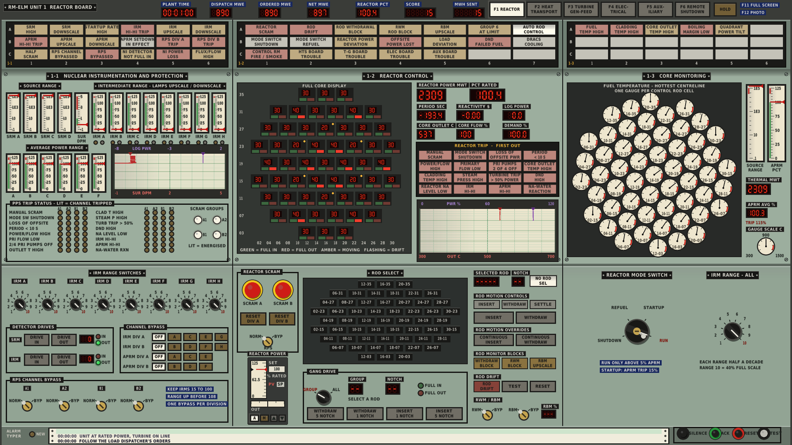
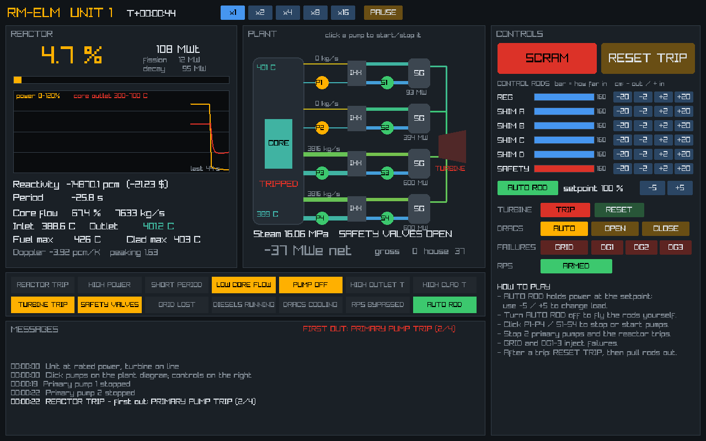
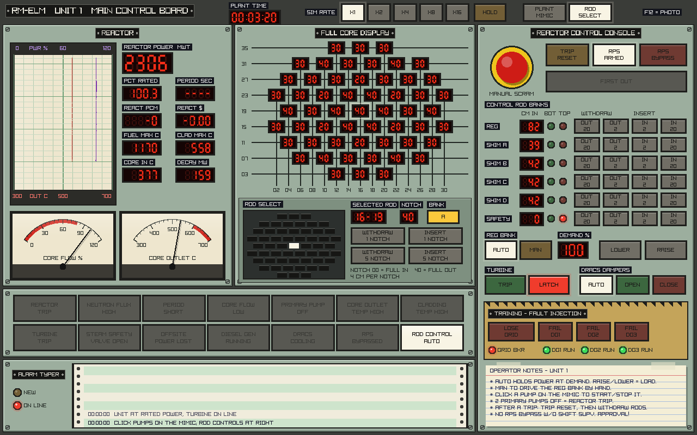

# RM-ELM

A realistic simulator of a fictional **Reduced-Moderation Epithermal
Liquid-Metal reactor**: a 2300 MWt, four-loop, sodium-cooled core moderated by
canned graphite and zirconium-hydride pins, fuelled with (U,Th) carbide
(20% U-235 / 30% U-238 / 50% Th-232 by heavy-metal weight).

Written in C17 with hand-written x86-64 assembly for the hot loops (with
portable C fallbacks that give identical results). The reactor physics comes
from lattice calculations on ENDF/B-VIII.1 nuclear data, not hand-tuned numbers.

## Build

Needs a C compiler (GCC or Clang), CMake 3.16+ and git.

```sh
cmake -S . -B build
cmake --build build
cd build && ctest --output-on-failure   # optional: run the test suite
```

On x86-64 the assembly kernels are assembled automatically by the compiler;
the program picks AVX or SSE2 at run time. On ARM or MSVC the C kernels are
used. Force C with `-DRMELM_USE_ASM=OFF`.

## Play: graphical control room

```sh
./build/rmelm_gui
```





A point-and-click main control board drawn in 1978 style. It has green
painted steel panels, red LED readouts, and needle meters. A strip-chart
recorder traces reactor power (violet pen) and core outlet temperature (red
pen). The plant mimic uses coloured tape lines; click a pump symbol to start
or stop it. The console has a mushroom-head manual scram, lit pushbuttons for
the rod banks (OUT/IN by 20 or 2 cm), AUTO/MAN regulating rod control with a
power demand, turbine trip/latch and DRACS dampers. A training sub-panel
injects faults (grid loss, diesel failures). Along the bottom are the
annunciator windows (red ones flash) and an alarm typer on green-bar paper.
Lamps follow the US convention of the period: red = running/closed,
green = stopped/open. The SIM RATE buttons set speed (X1 to X16), HOLD
pauses, and F12 saves a screenshot.



The ROD SELECT button (or TAB) swaps the plant mimic for a BWR-style full
core display. The upper board shows a 2-digit red LED readout for each of
the 55 rods, laid out in the shape of the core on a ruled grid. Each rod is
named by its grid coordinates (for example 16-19). Readouts show notch
position: 00 = fully in, 40 = fully out, 4 cm per notch. The desk below it
has the rod select matrix, with one black pushbutton per rod in the same
pattern. Press a button (or click a readout) to select that rod; its button
lights white. Then use WITHDRAW/INSERT 1 or 5 notches to drive that rod
alone. Hover over a rod to see its bank and depth. The bank buttons on the
console move a whole bank and keep each rod's offset. REG bank rods can only
be moved by hand after you select MAN.

The first `cmake` configure downloads raylib 5.5 automatically (or uses one
already installed). On Linux you need the X11/OpenGL development packages:
`sudo apt install libgl-dev libx11-dev libxrandr-dev libxinerama-dev
libxcursor-dev libxi-dev`. To skip the GUI: `-DRMELM_GUI=OFF`.

The GUI uses an OpenGL 2.1 context, which almost every driver supports. To
build for OpenGL 3.3 core instead: `-DRMELM_GL33=ON`.

## Play: terminal process computer

```sh
./build/rmelm
```

Linux, macOS or WSL terminal. Start-up takes about 20 seconds while the
whole plant converges to its rated-power heat balance: 2300 MWt, ~900 MWe net.

The screen shows the reactor (power, reactivity, period, rod banks, RPS
status and first-out trip), the core (flow, inlet/outlet, peak fuel and clad
temperatures), all four loops (pumps, sodium temperatures, feedwater, steam),
the steam plant and turbine-generator, a power trend and the message log.

| Command | What it does |
|---|---|
| `ROD <bank> <cm>` | drive a bank to a depth: 0 = out, 160 = in. Banks: `REG A B C D SAFE ALL` |
| `AUTO <%>` / `AUTO OFF` | automatic rod control: the REG bank holds reactor power at the setpoint (on at 100% by default) |
| `SCRAM` / `RESET` | trip the reactor / reset the protection system (rods stay in) |
| `PUMP P1..P4 START\|STOP\|PONY\|SPEED <%>` | primary pumps (`PONY` toggles the 10% pony motor) |
| `PUMP S1..S4 START\|STOP\|SPEED <%>` | intermediate (secondary) sodium pumps |
| `TURB TRIP\|RESET` | trip the turbine / reset and resynchronise |
| `PSET <MPa>` | steam pressure setpoint (turbine valve holds it) |
| `FW AUTO\|MAN` | feedwater control (auto holds 480 C steam) |
| `DRACS OPEN\|CLOSE\|AUTO` | decay heat removal coolers (auto opens on a reactor trip) |
| `FAIL\|FIX GRID`, `DG <1-3>`, `P1..P4`, `S1..S4` | inject or clear failures: grid loss, diesel generators, pumps |
| `RPS ON\|BYPASS` | arm or bypass the reactor protection system |
| `RUN <1-8>` | simulation speed |
| `HELP`, `QUIT` | |

Automatic reactor trips: power 115%, period 10 s, power/flow 1.15, primary
flow below 70%, two primary pumps off, core outlet 600 C, clad 700 C, steam
pressure 16.5 MPa, turbine trip above 50% power. A reactor trip trips the
turbine.

Things to try:

- Stop one primary pump: the other three pick up, outlet temperature rises.
- Stop two: the RPS trips the reactor; pony motors keep ~10% flow.
- `TURB TRIP` at full power and watch the bypass and safety valves.
- `RPS BYPASS`, then stop all four pumps: the unprotected loss-of-flow
  accident. This core is not passively safe - watch the clad temperature.
- `FAIL GRID`: loss of offsite power. The reactor trips, diesels start after
  10 s, pony motors keep 10% flow, DRACS takes over decay heat.
- `FAIL DG 1`, `FAIL DG 2`, `FAIL DG 3`, then `FAIL GRID`: station blackout.
  Only passive natural circulation through DRACS is left - and it's enough.
- After a SCRAM, `RESET` and restart the reactor by pulling the shim banks.
