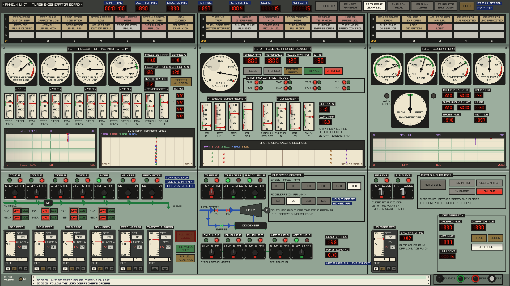
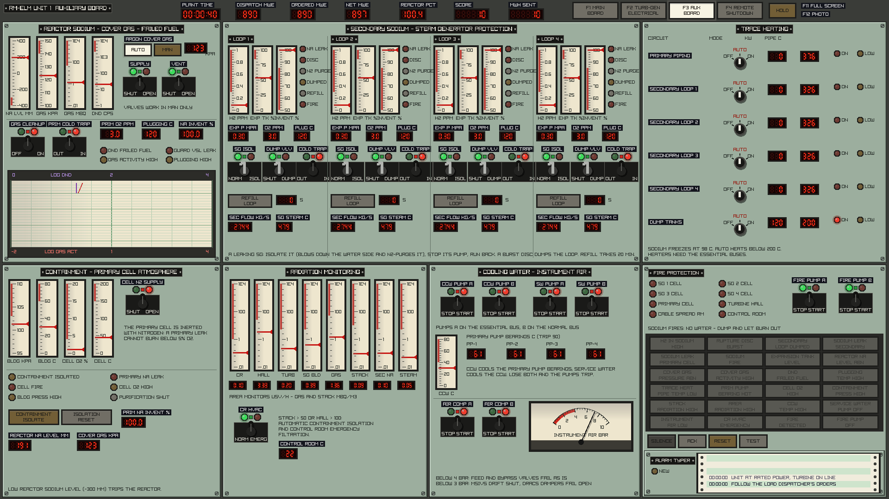
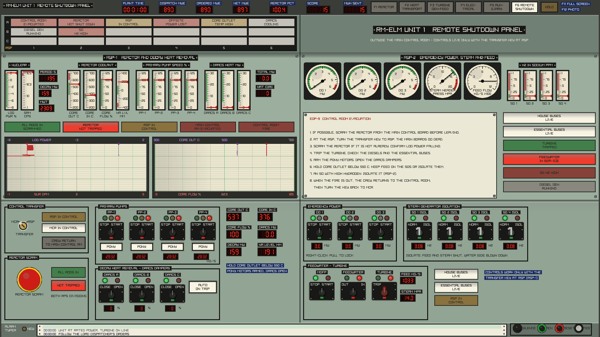

# RM-ELM

A realistic simulator of a fictional **Reduced-Moderation Epithermal
Liquid-Metal reactor**: a 2300 MWt, four-loop, sodium-cooled core moderated by
canned graphite and zirconium-hydride pins, fuelled with (U,Th) carbide
(20% U-235 / 30% U-238 / 50% Th-232 by heavy-metal weight).

Written in C17 with hand-written x86-64 assembly for the hot loops (with
portable C fallbacks that give identical results). The reactor physics comes
from lattice calculations on ENDF/B-VIII.1 nuclear data, not hand-tuned numbers.

## Build

Needs a C compiler (GCC or Clang), CMake 3.16+ and git.

```sh
cmake -S . -B build
cmake --build build
cd build && ctest --output-on-failure   # optional: run the test suite
```

On x86-64 the assembly kernels are assembled automatically by the compiler;
the program picks AVX or SSE2 at run time. On ARM or MSVC the C kernels are
used. Force C with `-DRMELM_USE_ASM=OFF`.

## Play: graphical control room

```sh
./build/rmelm_gui
```


A point-and-click control room drawn in 1978 style: flat painted-steel boards
with engraved nameplates and Dymo labels, needle and edgewise meters, red LED
readouts, strip-chart and multipoint recorders, pistol-grip and J-handle
control switches, key switches, and annunciator window boxes with a horn. Each
board is laid out on a 1920x1080 canvas and scaled to your display, borderless
full screen (F11 toggles it; `RMELM_WINDOWED=1` starts in a window). At launch
you pick **start at rated power** or **start from hot shutdown**, and whether
random equipment failures are on. The sim runs in real time. HOLD pauses it,
and F12 saves a screenshot (`screenshotNNN.png`).

There are four boards. Pick one with the buttons in the header or F1 to F4. A
board's button flashes when it has an unacknowledged alarm.

### Controls

- **Pistol-grip and J-handle switches.** Click the left half of a switch to
  turn it left (STOP, TRIP, OFF, SHUT), or the right half to turn it right
  (START, CLOSE, ON, OPEN). It springs back to centre. Green lamp = stopped/open, red = running/closed.
  The small target flag between the lamps shows the last operation, so a
  green lamp next to a red flag means the equipment tripped on its own. Right
  click a diesel generator switch for **pull-to-lock**, which blocks its
  automatic start.
- **Key switches.** Click to turn them (bypasses, the RPS key, the remote
  shutdown transfer).
- **Rotary selectors.** Click the legend of the position you want.
- **Annunciators** follow the ISA ringback sequence. A new alarm flashes fast
  and sounds the horn. SILENCE stops the horn. ACK makes the window steady.
  When the condition clears, the window flashes slowly until RESET. TEST
  lights every window. An alarm that clears before you ACK stays locked in.

### The job

The **load dispatcher** orders net output in MWe (header, DISPATCH MWE) and
changes the order every 10 to 20 minutes, with a ramp rate. You follow it with
the power demand (RAISE/LOWER) while automatic rod control holds the reactor
there.

Points:
- one point per MWh sent out within 3% of the order (half within 10%);
- +200 for synchronising;
- +300 for isolating a leaking steam generator before it fails;
- +300 for a safe shutdown from the remote shutdown panel within 10 minutes
  of evacuating the control room.

Penalties:
- -500 per reactor trip, -100 per turbine trip;
- -1000 for losing an SG to a sodium-water reaction;
- -200 per sodium fire;
- points bleed away while the RPS is bypassed, the cladding is over 650 C,
  or you run above 60% on failed fuel.

Equipment fails at random, about one event every 20 minutes at power:
- pump trips, a feed pump trip, a primary pump bearing going (loss of
  component cooling), a circulating water pump, vacuum loss;
- steam generator tube leaks, secondary sodium leaks and fires, a failed fuel
  pin, a primary leak into the guard vessel, a cold trap out of service;
- turbine trips, rising turbine vibration;
- grid faults, a latent bus transfer fault, diesels out of service;
- a stuck rod drifting out;
- instrument air compressor failure;
- fires in the cable spreading room, the turbine hall and the control room.

### Main control board (F1)

Top row, the reactor:

- **Reactor**: strip chart (power in violet, core outlet in red) and LED
  readouts: MWt, percent, period, reactivity, log power, peak fuel and clad.
- **Full core display**: a 2-digit notch readout for each of the 55 rods
  (00 = fully in, 40 = fully out, 4 cm per notch; rods named by grid
  coordinates such as 16-19). A drifting rod's readout flashes red. The rod
  select matrix has one pushbutton per rod: select one, then WITHDRAW/INSERT
  it. The **rod block monitor** reading for the selected rod is shown below.
- **Core monitoring**:
  - the core fuel temperature map: 55 round gauges, one per control rod
    cell (the rod and the six fuel channels round it, the hex version of a
    BWR four-bundle control cell). Each reads the hottest fuel centreline
    temperature in its cell, 300-1500 C, and its bezel flashes red above
    1300 C. The rod's coordinates are printed on the dial. Hover over a
    gauge for its group, notch and temperature;
  - source range and APRM meters, thermal power in MWth;
  - the **reactor mode switch**: SHUTDOWN / REFUEL / STARTUP / RUN;
  - a gang IRM range switch that sets all eight IRMs at once.
- **Neutron monitoring and RPS**:
  - SRM A-D (log counts), IRM A-H with their own range switches (up/down),
    APRM A-F, all on edgewise meters;
  - SRM and IRM detector drives (INSERT/RETRACT, one minute end to end);
  - IRM and APRM bypass selectors, one channel per division;
  - the four RPS scram group lamps A1, A2, B1, B2 (lit = energised, they go
    out when the channel trips), with a bypass key for each (one per
    division);
  - rod worth minimizer and rod block monitor status and bypass keys.

Bottom row:

- **Rod control and reactor protection**:
  - two manual scram buttons, one per RPS division. One gives a half scram;
    you need both for a full scram;
  - a RESET per division (it lights when that division is tripped) and the
    RPS bypass key;
  - the first-out window;
  - the rod drive: a ROD MOTION switch (GROUP or ALL) and WITHDRAW/INSERT
    1 or 5 notches. GROUP drives the whole group of the rod selected on the
    full core display; ALL drives every rod. The rods are in six groups,
    numbered in withdrawal order: 1 safety, 2-5 shims, 6 regulating (the
    one automatic control drives);
  - AUTO/MAN and the power demand;
  - rod control status. A scram drops rod control to MAN.
- **Sodium pumps**: a pistol-grip switch, speed, setpoint and pony motor for
  each of the eight pumps, plus the **master flow controller**, which sets
  all four primary pump speeds together.
- **Annunciators** (30 windows) with SILENCE/ACK/RESET/TEST, the
  **isolation** panel (FIV and MSIV for each SG, SG isolate, containment
  isolation, all-MSIV shut) and the alarm typer.
- **Decay heat removal (DRACS)**: damper switches for the three trains, heat
  removed, auto-open on trip, the four hydrogen-in-sodium meters, and a
  multipoint recorder of core outlet, core inlet and the four hot legs.

### Turbine-generator and electrical board (F2)



- **Main turbine**:
  - TRIP/LATCH, turning gear and auxiliary oil pump switches;
  - speed target (0 to 1800 rpm) and acceleration (60 to 600 rpm/min)
    selectors, with ACCEL / AT SPEED / CRITICAL SPEED lamps;
  - stop and control valve lamps;
  - supervisory instruments (vibration, eccentricity, bearing temperature,
    lube oil pressure) with a multipoint supervisory recorder.
  - Trips: overspeed 110%, vibration 7 mils, bearing 107 C, oil 0.6 bar,
    condenser vacuum 25 kPa. The turbine will not latch without oil pressure,
    with eccentricity over 2 mils, below 5 MPa steam or with poor vacuum. A
    rotor left standing off the turning gear bows (eccentricity rises), and a
    bowed rotor shakes hard through the critical speed near 1100 rpm.
- **Generator**:
  - MW, MVAR, kV and Hz meters;
  - field breaker (flash it above 1500 rpm);
  - voltage regulator AUTO/MAN with manual excitation;
  - a **synchroscope** with dark-lamp sync lamps;
  - AUTO SYNC, which trims the speed and closes the breaker in phase;
  - a GEN MW / RPM strip chart.
  - Closing the breaker by hand out of phase trips the unit.
- **Main steam and feedwater control**: steam pressure, flow and feed
  temperature, pressure setpoint, bypass and safety valves, feedwater in/out
  of service and AUTO/MAN, and per SG the feed flow, valve (manual +/-),
  steam temperature, steam flow, heat and MSIV.
- **Feedwater, condensate, circulating water**:
  - two 60% turbine-driven feed pumps (they need steam above 4 MPa);
  - a 25% motor-driven startup pump;
  - two condensate pumps, HP heaters in/out;
  - hotwell and deaerator levels;
  - three circulating water pumps and two vacuum pumps, condenser pressure
    and air.
- **Electrical one-line**, a mimic from the 345 kV grid:
  - the switchyard breaker, main transformer, generator breaker, generator;
  - the startup and unit auxiliary transformers and the 6.9 kV house buses
    with the bus transfer switch. When the generator trips, the house load
    fast-transfers to the startup transformer, unless the transfer relay
    has a fault;
  - three 4.16 kV essential buses with the diesels (load in MW, run,
    out-of-service and cranking lamps, pull-to-lock);
  - two 125 V DC divisions with battery charge, chargers and the vital AC
    inverters. The nuclear instruments of a division go dead without its
    inverter, and the diesels need DC to crank.

### Auxiliary board (F3)



- **Reactor sodium, cover gas, failed fuel**:
  - vessel sodium level (low level trips the reactor);
  - argon cover gas pressure with AUTO/MAN and supply/vent valves;
  - cover gas cleanup;
  - failed fuel detection: delayed neutron detectors (trip at 2000 cps) and
    cover gas activity, with a strip chart;
  - the primary cold trap, oxygen and plugging temperature, and the guard
    vessel leak alarm.
- **Secondary sodium and SG protection**, for each loop:
  - hydrogen meter, expansion tank level and pressure, sodium inventory;
  - leak, rupture disc, N2 purge, dumped, refill and fire lamps;
  - oxygen and plugging temperature;
  - SG isolation (blowdown and N2 purge), the dump valve, the cold trap and
    REFILL (20 minutes, refused while the SG still leaks).
- **Trace heating**: six circuits (primary piping, the four secondary loops,
  the dump tanks), each OFF/AUTO/ON, with kW and pipe temperature. Sodium
  freezes at 98 C.
- **Containment**: building pressure and temperature, primary cell oxygen and
  temperature, the cell nitrogen supply (a primary leak cannot burn below
  5% O2), and containment isolation.
- **Radiation monitoring**: eight log-scale area and process monitors. A
  high stack or hall reading isolates containment and puts the control room
  HVAC on emergency filtration.
- **Cooling water and instrument air**:
  - component cooling water and service water pumps. The primary pump
    bearings trip at 90 C without them;
  - instrument air compressors. Below 4 bar the air-operated feed and bypass
    valves fail as is. Below 3 bar the MSIVs drift shut and the DRACS
    dampers fail open;
  - control room HVAC.
- **Fire protection**: fire lamps for eight zones and the electric and diesel
  fire pumps. Sodium fires are not fought with water: dump the loop and let
  the pool burn out.

### Remote shutdown panel (F4)



A fire in the control room fills it with smoke. After a minute the crew
evacuates: the main boards go grey and dead, and the game switches to the
remote shutdown panel. Turn the **transfer key** to RSP to take control; the
main boards stay dead while the RSP has control.

The panel has:
- a reactor scram, log power, source range, period, core temperatures, flow,
  sodium level and decay heat;
- the primary pumps and pony motors, and the DRACS dampers;
- the diesels and bus status;
- SG isolation and hydrogen, steam pressure;
- the motor-driven feed pump, feedwater and turbine trip.

The evacuation procedure is printed on the panel. When the fire is out,
RETURN TO MAIN CONTROL ROOM, then turn the key back to MCR.

### Starting up from hot shutdown


All 55 rods are in, the reactor is deeply subcritical (about -14,700 pcm),
the sodium is isothermal at 380 C with the pumps running, feedwater is out of
service, the motor-driven feed pump runs, the turbine is on its turning gear
and the mode switch is in SHUTDOWN.

1. Turn the mode switch to STARTUP. The SRM and IRM detectors are in.
2. Select a group 1 rod on the full core display (hover to see a rod's
   group), set ROD MOTION to GROUP and withdraw it fully: WITHDRAW 5 NOTCH
   until the FULL OUT lamp lights. The rods take about a minute to travel.
3. Set ROD MOTION to ALL and withdraw 5 notches at a time. Below 20% power
   the rod worth minimizer wants group 1 fully out first and groups 2-5
   within 5 notches of each other, which ALL does for you. Watch the SRM
   count rate and the period, and go to single notches as it shortens. The
   core goes critical with the rods roughly half out. A period
   shorter than 10 s trips the reactor.
4. As power rises, range the IRMs up (the gang switch, or each channel's
   arrows) to keep them between about 15 and 100. Above 108 withdrawal is
   blocked, and above 120 a channel trips its RPS division.
5. Set the demand to a few percent and select AUTO. Automatic rod control
   limits the startup rate to a period of about 60 s or longer.
6. On the turbine board, put the feedwater in service. Raise power to about
   10% APRM and turn the mode switch to RUN (refused below 5%, and it must
   happen before the 15% APRM setdown trip). Retract the SRM and IRM
   detectors.
7. On the turbine board, with steam above 5 MPa, LATCH the turbine, set the
   speed target to 1800 and the acceleration to 300. Above 1500 rpm, close
   the field breaker. Then press AUTO SYNC, or watch the synchroscope and
   close the generator breaker yourself when the pointer turns slowly
   through 12 o'clock. The dispatcher takes over.
8. Start the turbine feed pumps before going much above 20% (the startup pump
   gives only 25%). Raise the demand. When the GROUP 6 AT LIMIT annunciator
   lights, withdraw groups 2-5 a notch or two (GROUP mode) to give the
   regulating group room.

### Steam generator leaks

A tube leak lets water into the secondary sodium. The sodium-water reaction
makes hydrogen, and the jet wastes neighbouring tubes, so the leak doubles
about every 90 s. The hydrogen meter (H2 PPM) is the only warning: the H2 IN
SODIUM HIGH alarm comes in at 0.3 ppm, when the leak is around 1 g/s. From
there you have about 15 minutes. Isolate that SG, stop its secondary pump
and run back to about 75%. If you don't, the leak reaches 2 kg/s, the
rupture disc bursts, the loop's sodium is dumped and the reactor trips. A
dumped loop can be refilled from the auxiliary board once the SG no longer
leaks.

### Building on Linux

The first `cmake` configure downloads raylib 5.5 automatically (or uses one
already installed). On Linux you need the X11/OpenGL development packages,
plus the Wayland ones if you run a Wayland desktop. The GUI then talks to the
compositor natively instead of going through XWayland:

- Debian/Ubuntu: `sudo apt install libgl-dev libx11-dev libxrandr-dev
  libxinerama-dev libxcursor-dev libxi-dev libwayland-dev libxkbcommon-dev
  wayland-protocols`
- Arch: `sudo pacman -S --needed base-devel cmake git libx11 libxrandr
  libxinerama libxcursor libxi mesa wayland wayland-protocols libxkbcommon`

CMake prints `RM-ELM: GUI with native Wayland and X11` when it found the
Wayland files. To skip the GUI: `-DRMELM_GUI=OFF`.

The GUI uses an OpenGL 2.1 context, which almost every driver supports. To
build for OpenGL 3.3 core instead: `-DRMELM_GL33=ON`.

## Play: terminal process computer

```sh
./build/rmelm                  # at rated power
./build/rmelm --hot            # from hot shutdown
./build/rmelm --no-failures    # no random equipment failures
```

Linux, macOS or WSL terminal. Start-up takes about 20 seconds while the
plant converges. The same plant, dispatcher, score and failures as the GUI.
The terminal works the reactor, pumps, feedwater, turbine and DRACS with
simple commands. The individual NMS channels and bypasses, the electrical
distribution, the sodium auxiliaries, the support systems and the remote
shutdown panel are only on the GUI boards. In the terminal a control room
fire only shows as messages: the commands keep working.

The screen shows:
- the load dispatcher's order, your deviation and the score;
- the reactor: power, reactivity, period, rod banks, RPS status and first out;
- the core: flow, inlet/outlet, peak fuel and clad temperatures;
- all four loops: pumps, sodium temperatures, feedwater, steam and hydrogen;
- the steam plant and turbine-generator;
- a power trend and the message log.

| Command | What it does |
|---|---|
| `ROD <bank> <cm>` | drive a bank to a depth: 0 = out, 160 = in. Banks: `REG A B C D SAFE ALL` |
| `AUTO <%>` / `AUTO OFF` | automatic rod control: the REG bank holds reactor power at the demand |
| `SCRAM` / `RESET` | trip the reactor / reset the protection system (rods stay in) |
| `PUMP P1..P4 START\|STOP\|PONY\|SPEED <%>` | primary pumps (`PONY` toggles the 10% pony motor) |
| `PUMP S1..S4 START\|STOP\|SPEED <%>` | intermediate (secondary) sodium pumps |
| `FW START\|STOP` | feedwater in or out of service (START also runs the condensate and turbine feed pumps) |
| `FW AUTO\|MAN` | feedwater control (auto holds the cold legs at 380 C) |
| `SG <1-4> ISOLATE` | isolate a steam generator (feed and steam valves shut, blown down) |
| `TURB TRIP\|RESET` | trip the turbine / latch, roll to 1800 rpm and auto-synchronise (steam above 5 MPa) |
| `PSET <MPa>` | steam pressure setpoint (turbine valve holds it) |
| `DRACS OPEN\|CLOSE\|AUTO` | decay heat removal coolers (auto opens on a reactor trip) |
| `MODE SD\|REFUEL\|STARTUP\|RUN` | reactor mode switch |
| `IRM <1-10>` | IRM range switch |
| `RPS ON\|BYPASS` | arm or bypass the reactor protection system |
| `HELP`, `QUIT` | |

Automatic reactor trips:
- power 115% (in RUN), APRM setdown 15% and IRM high (in STARTUP/REFUEL),
  mode switch to SHUTDOWN;
- period 10 s, power/flow 1.15;
- primary flow below 70%, two primary pumps off;
- core outlet 600 C, clad 700 C;
- steam pressure 16.5 MPa;
- turbine trip above 50% power;
- loss of offsite power;
- a steam generator rupture disc bursting.

A reactor trip trips the turbine. After a trip, DRACS takes the decay heat by
natural circulation even with no power at all.
